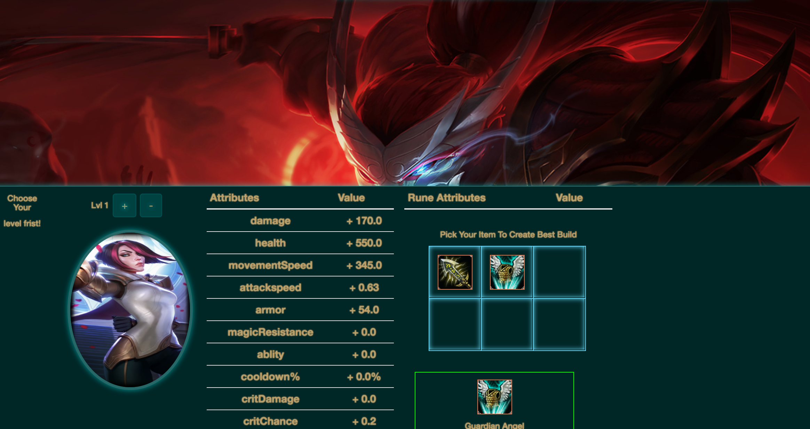

# LolReactWeb  
[](https://travis-ci.org/liubinyi/LolReactWeb)

## INFO  
* A single page web application that generate build packages for summoners(users)
* front end built with react-redux
* back end built with Golang
* WebSite URL  https://yasuogg.herokuapp.com/


# How it works  

* Load Your summoner Info by using the search box
* Choose the Rune Page that you would like to use and load it
* Choose Your favorite chamption from the chamption list
* Choose Your Item from Item Sections and click Apply
* Then Your build package will show up



# Developer Notes  
## npm pacakages
### some dev notes for future reference
```npm init -y
	npm i -S react react-dom
	npm i -D babel-core babel-loader babel-preset-es2015 babel-preset-react
	react-hot-loader webpack webpack-dev-server
	npm i -g webpack webpack-dev-server
	npm i --save lodash
	npm install xregexp
	touch webpack.config.js
	touch index.html
```

## test packages  
### some test notes for future reference  
``` npm install --save-dev jest babel-jest babel-preset-es2015 babel-preset-react
 react-test-renderer
  npm install --save-dev babel-jest babel-polyfill
  npm install --save-dev enzyme react-addons-test-utils
  npm install -g npm-check-updates
  ncu -u
```

### additional configurations  
* also need to add .babelrc file

# run tests  
* npm run test


## kill npm dev server  
* ps -ax | grep node
* kill -9 <pid>
* lsof -i tcp:3000

## local Server  
* http://localhost:8080

## deployment  
* cd my-project/
* git init
* heroku git:remote -a appname
* git add .
* git commit -am "something"
* git push heroku master
