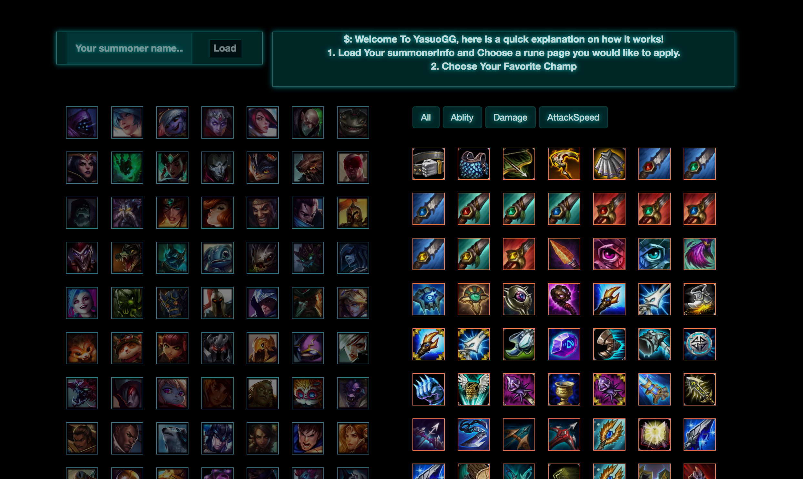

# LolReactWeb
============================

##INFO
* A single page web application that display league in champion and build status
* front end built with react - redux
* back end built with Golang

#How it works

* Load Your summoner Info
* Choose Your Rune Page
* Load rune page
* Choose Your Mastery Page
* Load Mastery Page
* Choose Your favorite Chamption
* Choose Your Item and Apply the effect
* Choose Your Build

#npm pacakages
* npm init -y
* npm i -S react react-dom
* npm i -D babel-core babel-loader babel-preset-es2015 babel-preset-react
* react-hot-loader webpack webpack-dev-server
* npm i -g webpack webpack-dev-server
* npm i --save lodash
* npm install xregexp
* touch webpack.config.js
* touch index.html

#test pacakages
* npm install --save-dev jest babel-jest babel-preset-es2015 babel-preset-react 
 react-test-renderer
* npm install --save-dev babel-jest babel-polyfill
* npm install --save-dev enzyme react-addons-test-utils
* npm install -g npm-check-updates
* ncu -u

#additional configurations
* also need to add .babelrc file

#run tests
* npm run test

##kill npm dev server
* ps -ax | grep node
* kill -9 <pid>
* lsof -i tcp:3000 

##local Server
* http://localhost:8080

## deployment
* cd my-project/
* git init
* heroku git:remote -a appname
* git add .
* git commit -am "something"
* git push heroku master

